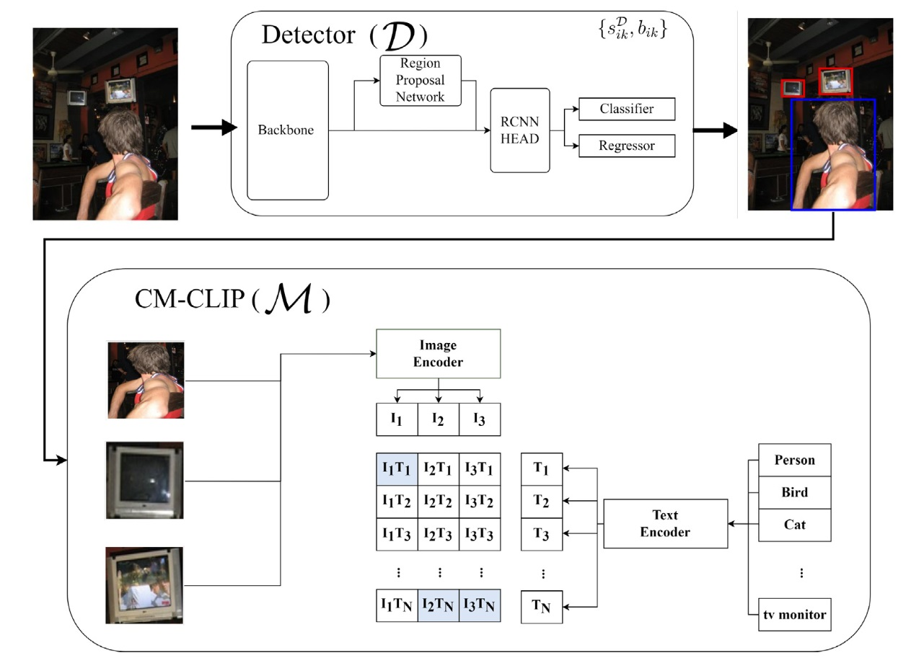

# Re-scoring using image-language similarity for few-shot object detection

Min Jae Jung, Seung Dae Han, and JooHee Kim

<div align="center"></div>

This repository is the implementation of our CVIU paper, [Re-scoring using image-language similarity for few-shot object detection
](https://www.sciencedirect.com/science/article/pii/S1077314224000377).

# Abstract

Few-shot object detection, which focuses on detecting novel objects with few labels, is an emerging challenge in the community.
Recent studies show that adapting a pre-trained model or modified loss function can improve performance.
In this paper, we explore leveraging the power of Contrastive Language-Image Pre-training (CLIP) and hard negative classification loss in low data setting.
Specifically, we propose Re-scoring using Image-language Similarity for Few-shot object detection (RISF) which extends Faster R-CNN by introducing Calibration Module using CLIP (CM-CLIP) and Background Negative Re-scale Loss (BNRL).
The former adapts CLIP, which performs zero-shot classification, to re-score the classification scores of a detector using image-class similarities,
the latter is modified classification loss considering the punishment for fake backgrounds as well as confusing categories on a generalized few-shot object detection dataset.
Extensive experiments on MS-COCO and PASCAL VOC show that the proposed RISF substantially outperforms the state-of-the-art approaches.

# Installation
## Requirements
- Linux with Python ≥ 3.7
- PyTorch ≥ 1.8 and torchvision that matches the PyTorch installation.

    We recommend you to use a conda environment
    ```bash
    conda create -n risf python=3.7 -y
    conda activate risf
    ```
- Install Pytorch
    ```
    pip install torch==1.8.0+cu111 torchvision==0.9.0+cu111 torchaudio==0.8.0 -f https://download.pytorch.org/whl/torch_stable.html
    ```
- Install Detectron2
    ```
    python -m pip install detectron2 -f https://dl.fbaipublicfiles.com/detectron2/wheels/cu111/torch1.8/index.html
    ```


# Usage
### Dataset Preparation
Please download MS-COCO and PASCAL-VOC dataset and organize it in the following structure:

    ...
    datasets
    | -- coco (trainval2014/*.jpg, val2014/*.jpg, annotations/*.json)
    | -- cocosplit
    | -- VOC2007
    | -- VOC2012
    | -- vocsplit
    risf
    tools
    ...

## Training

- Fist-Stage (base training)
```bash
python main.py --num-gpus {your_gpus} --config-file configs/coco/base.yaml
```

- Second-Stege (few-shot fine tuning)
```bash
python main.py --num-gpus {your_gpus} --config-file configs/coco/fsod_10shot_seed0.yaml
```


## Evaluation
```bash
python main.py --num-gpus {your_gpus} --config-file configs/coco/fsod_10shot_seed0.yaml --eval-only
```

# Acknowlegement


RISF builds on previous works code base such as [detectron2](https://github.com/facebookresearch/detectron2) and [DeFRCN](https://github.com/er-muyue/DeFRCN?tab=readme-ov-file). 
If you found RISF useful please consider citing these works as well.

# Citing 
```
@article{JUNG2024103956,
title = {Re-scoring using image-language similarity for few-shot object detection},
journal = {Computer Vision and Image Understanding},
pages = {103956},
year = {2024},
issn = {1077-3142},
doi = {https://doi.org/10.1016/j.cviu.2024.103956},
url = {https://www.sciencedirect.com/science/article/pii/S1077314224000377},
author = {Min Jae Jung and Seung Dae Han and Joohee Kim},
}
```